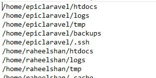
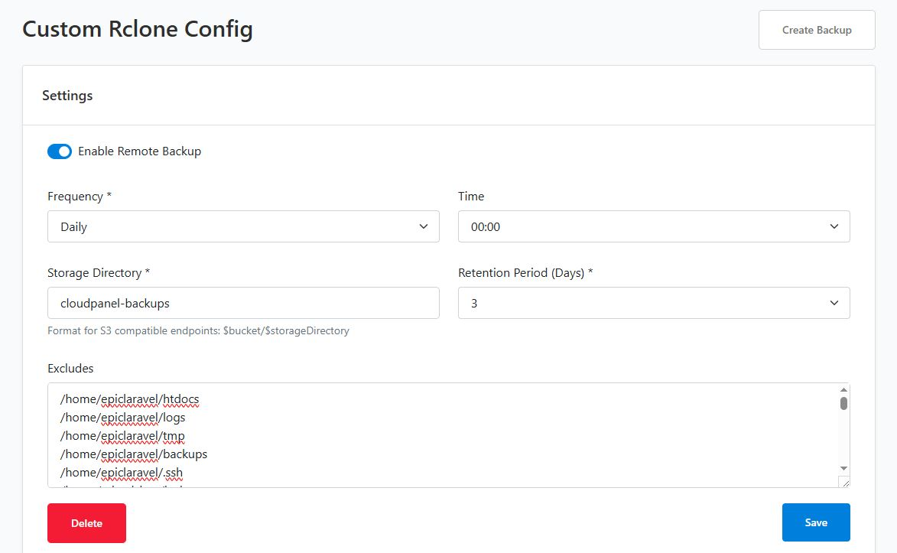

# CloudPanel Directory Export Manager

## Overview
A web-based interface that simplifies managing CloudPanel backup exclusions. Without this tool, users would manually navigate through sites to collect folder paths for exclusion.

This application:
- Scans all sites and directories with sizes
- Provides checkboxes to select folders for exclusion
- Exports exclude rules as a plain text file
- File can be pasted directly into CloudPanel's backup exclude textarea

## Prerequisites
- CloudPanel with multi-site hosting
- Nginx web server
- PHP 7.4+ with SQLite support
- Command line access to server

## Installation

### 1. Generate Password Hash
Run this PHP command to generate a secure password hash:
```bash
php -r "echo password_hash('YourStrongPassword123', PASSWORD_DEFAULT);"
```
Copy the output hash.

### 2. Configure Authentication
Open `config/auth.php` and replace the `APP_PASSWORD_HASH` value with the generated hash:
```php
define(
    'APP_PASSWORD_HASH',
    '$2y$12$...' // Replace with your generated hash
);
```

### 3. Set Up Database
The SQLite database (`storage/selections.sqlite`) will be created automatically on first access.

Ensure `storage/` directory has write permissions:
```bash
chmod 755 storage/
```

## Setup

1. Create a new PHP site in CloudPanel
2. Upload all files from this repository to the site root
3. Complete your setup by running the directory scan script:
   ```bash
   ./cloudpanel-sites-scan.sh
   ```
4. Access the interface at `http://your-site-domain`

## Usage

### Step 1: Scan Directories
Run `cloudpanel-sites-scan.sh` to generate `sites.json` with all sites, paths, and sizes.

### Step 2: Select Exclusions
- Browse through all sites and directories
- Check checkboxes for folders you want to exclude from backups
- Use domain-level checkboxes to select all paths for a domain

### Step 3: Save Selection
Click "Save Selection" button to persist choices to the database.

### Step 4: Export Excludes
Click "Export Excludes" to download `excludes.txt` file.

### Step 5: Apply in CloudPanel
Go to CloudPanel Backup section, copy all content from the downloaded file, and paste it into the Exclude Textarea.

**Important**: Export only works after saving selections.

## Screenshots

- **Login Screen**: 
- **Directory List**: 
- **Export List**: 
- **Excludes Export**: 

## Scripts

### cloudpanel-sites-scan.sh
Scans all CloudPanel sites and generates `storage/sites.json` with:
- Domain name
- Directory path
- Directory size

**Important**: Adjust the `OUTPUT` variable in this script to match your actual CloudPanel site path.

### cloudpanel-backup-cleaner.sh
Manages CloudPanel database backups by retaining the most recent backups and deleting older ones. The number of backups to keep is controlled by the KEEP_DAYS variable (default: 1 day).

#### Key Features:
- Retains specified number of recent backups (configurable)
- Automates backup cleanup process
- Compatible with the backup exclude manager workflow
- Safe deletion with timestamp-based retention

#### Configuration:
Change retention period by editing at the top of the script:
```bash
KEEP_DAYS=7 # Keep last 7 days of backups
```
Adjust `KEEP_DAYS` based on your backup policy requirements.

#### Usage:
- **Run manually**: `./cloudpanel-backup-cleaner.sh`
- **Automate with cron**: See below for cron job examples

#### Location:
- Script path: `cloudpanel-backup-cleaner.sh`
- Backup directories: `/home/*/backups/databases/`

#### Technical Details:
1. Searches for backup directories using path pattern matching
2. Maintains newest backups first
3. Preserves exactly KEEP_DAYS number of backups
4. Uses date-based directory naming convention (YYYY-MM-DD)
5. Processes all user-specific backup directories in `/home/`

#### Cron Job Automation
Set up automated execution with cron jobs. Common schedules:

**Option 1: Run every day at 2 AM (recommended)**
```bash
# Edit crontab
crontab -e

# Add this line:
0 2 * * * /absolute/path/to/cloudpanel-backup-cleaner.sh >> /var/log/cloudpanel-backup-cleanup.log 2>&1
```

**Option 2: Run every Sunday at 3 AM (weekly cleanup)**
```bash
0 3 * * 0 /absolute/path/to/cloudpanel-backup-cleaner.sh >> /var/log/cloudpanel-backup-cleanup.log 2>&1
```

**Option 3: Run both scripts daily (recommended for optimal sync)**
```bash
# Runs backup cleaner at 1:30 AM
0 1 * * * /absolute/path/to/cloudpanel-backup-cleaner.sh >> /var/log/cloudpanel-backup-cleanup.log 2>&1

# Runs site scanner at 2:00 AM (30 minutes later)
30 2 * * * /absolute/path/to/cloudpanel-sites-scan.sh >> /var/log/cloudpanel-site-scan.log 2>&1
```

**Important Cron Notes:**
- Use absolute paths to scripts (`/home/user/cloudpanel-backup-cleaner.sh`)
- Redirect output to log file for debugging
- Test scripts manually before setting up cron
- Ensure cron user has execute permissions on scripts
- Set proper PATH in crontab if commands aren't found

**Setting Up Cron:**
```bash
# Open crontab for current user
crontab -e

# Add your cron job
# Save and exit (Ctrl+X, Y, Enter in nano)

# To list existing cron jobs
crontab -l
```

#### Safety Notes:
- Always verify backups before enabling automated cleanup
- Test retention settings before deploying to production
- Backup directory paths must match your CloudPanel configuration
- Check log files regularly for errors
- Consider adding email notifications for critical failures
- Ensure proper file permissions for script execution

## Maintenance
- Update password hash in `config/auth.php` periodically
- Run `cloudpanel-sites-scan.sh` periodically to refresh directory listings
- Adjust `KEEP_DAYS` in `cloudpanel-backup-cleaner.sh` as needed
- Secure `storage/` directory with proper permissions

## Security Notes
- This app uses hardcoded credentials - rotate password regularly
- Store `storage/` outside webroot if possible
- Use HTTPS in production
- Change default username 'admin' if needed
