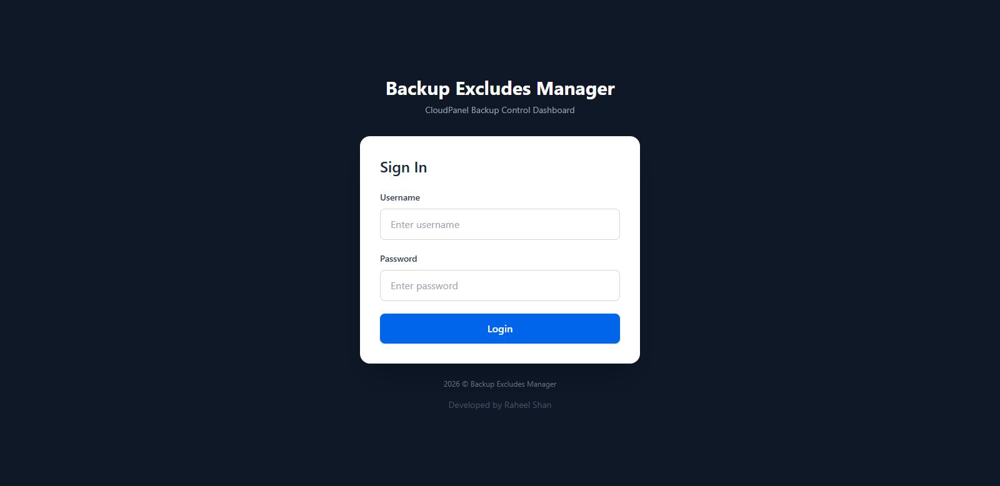
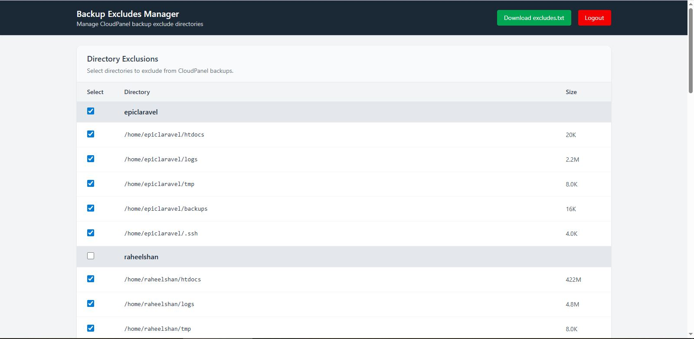

# CloudPanel Directory Export Manager

## Overview
A web-based interface that simplifies managing CloudPanel backup exclusions. Without this tool, users would manually navigate through sites to collect folder paths for exclusion.

This application:
- Scans all sites and directories with sizes
- Provides checkboxes to select folders for exclusion
- Exports exclude rules as a plain text file
- File can be pasted directly into CloudPanel's backup exclude textarea

## Prerequisites
- CloudPanel with multi-site hosting
- Apache/Nginx web server
- PHP 7.4+ with SQLite support
- Command line access to server

## Installation

### 1. Generate Password Hash
Run this PHP command to generate a secure password hash:
```bash
php -r "echo password_hash('YourStrongPassword123', PASSWORD_DEFAULT);"
```
Copy the output hash.

### 2. Configure Authentication
Open `config/auth.php` and replace the `APP_PASSWORD_HASH` value with the generated hash:
```php
define(
    'APP_PASSWORD_HASH',
    '$2y$12$...' // Replace with your generated hash
);
```

### 3. Set Up Database
The SQLite database (`storage/selections.sqlite`) will be created automatically on first access.

Ensure `storage/` directory has write permissions:
```bash
chmod 755 storage/
```

## Setup

1. Create a new PHP site in CloudPanel
2. Upload all files from this repository to the site root
3. Complete your setup by running the directory scan script:
   ```bash
   ./cloudpanel-sites-scan.sh
   ```
4. Access the interface at `http://your-site-domain`

## Usage

### Step 1: Scan Directories
Run `cloudpanel-sites-scan.sh` to generate `sites.json` with all sites, paths, and sizes.

### Step 2: Select Exclusions
- Browse through all sites and directories
- Check checkboxes for folders you want to exclude from backups
- Use domain-level checkboxes to select all paths for a domain

### Step 3: Save Selection
Click "Save Selection" button to persist choices to the database.

### Step 4: Export Excludes
Click "Export Excludes" to download `excludes.txt` file.

### Step 5: Apply in CloudPanel
Go to CloudPanel Backup section, copy all content from the downloaded file, and paste it into the Exclude Textarea.

**Important**: Export only works after saving selections.

## Screenshots

- **Login Screen**: 
- **Directory List**: 

## Scripts

### cloudpanel-sites-scan.sh
Scans all CloudPanel sites and generates `storage/sites.json` with:
- Domain name
- Directory path
- Directory size

**Important**: Adjust the `OUTPUT` variable in this script to match your actual CloudPanel site path.

### cloudpanel-backup-cleaner.sh
Manages CloudPanel database backups. Keeps only the most recent `KEEP_DAYS` backups (default: 1 day).

Change retention period by editing `KEEP_DAYS` variable:
```bash
KEEP_DAYS=7  # Keep last 7 days of backups
```

## Maintenance
- Update password hash in `config/auth.php` periodically
- Run `cloudpanel-sites-scan.sh` periodically to refresh directory listings
- Adjust `KEEP_DAYS` in `cloudpanel-backup-cleaner.sh` as needed
- Secure `storage/` directory with proper permissions

## Security Notes
- This app uses hardcoded credentials - rotate password regularly
- Store `storage/` outside webroot if possible
- Use HTTPS in production
- Change default username 'admin' if needed
